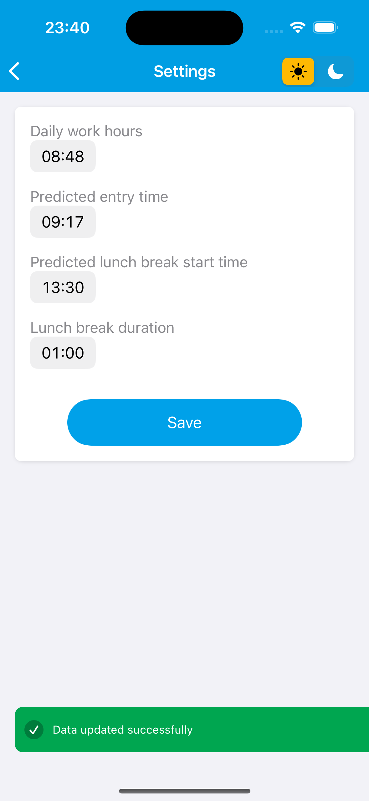
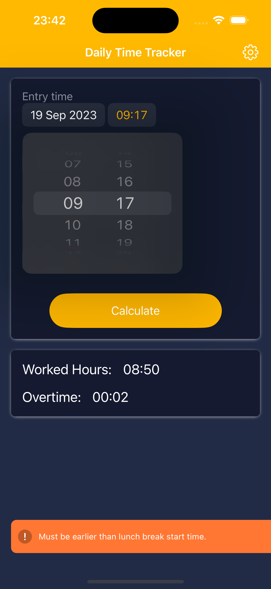
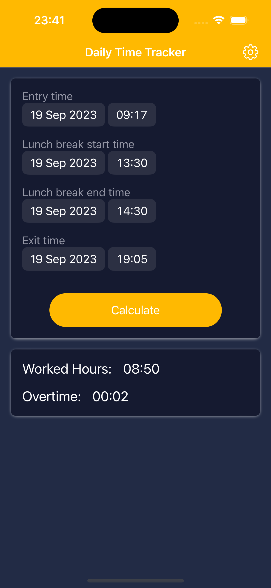
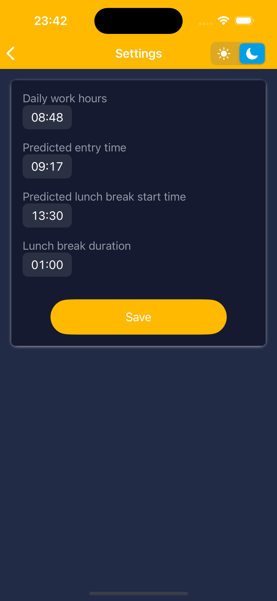

[🇧🇷](README_pt-br.md "Visualize o README em Português")

  <a href="./README_pt-br.md" title="Visualize o README em Português"><h1>🇧🇷</h1></a>

# Daily Time Tracker App

## Welcome to the Daily Time Tracker App Repository!

The Daily Time Tracker App is a simple and practical tool designed to help users manage their daily work schedule. This app is designed to calculate an estimated departure time based on user-configured working hours and display the total time worked on the current day.

## App Screenshots

| App Video | Launch Screen | Home Screen (Light) |
| :---: | :---: | :---: |
|  |  |  |
|  |  |  |
| Alert Message (Light) | Hours Worked Calculation (Light) | Settings Screen (Light) |
|  |  |  |
|  |  |  |
| Alert Message (Dark) | Hours Worked Calculation (Dark) | Settings Screen (Dark) |
|  |  |  |

## Features

- Departure Prediction: Based on defined working hours, the app calculates an estimate of the user's departure time.
- Time Tracking: Monitor the total hours worked on the current day.
- Custom Configuration: Set your daily working hours in the app settings.
- Language Selection: Based on your mobile device's language settings, the app automatically selects the language (currently only English and Portuguese).
- Custom Theme: Choose whether the app uses light mode or dark mode.

## Technologies Used

The app was developed using the Swift programming language, using 100% native code. This means you don't need to install any dependencies to run the app.

## How to Use

1. Install the app on your mobile device.
2. Configure your daily working hours in the app settings.
3. The app will automatically calculate the estimated departure time and the time worked on the current day.

## Key Learnings and Challenges

### Programatically

- Implementation of `Localization` in the app to switch between English and Portuguese based on the device's language settings.
- Implementation of a user-configurable Theme (light/dark mode).
- Use of `UserDefaults` to persist data related to the selected theme (light/dark mode) and user settings.
- Utilization of `observers` to manage theme switching.
- Creation of a `Toast` component to send user notifications, including configuration options for `success`, `failed`, `alert`, and `neutral` notifications.
- Implementation of transition animations within the `Toast` component.

### In Storyboard

- Use of a set of adaptable colors based on the selected theme (light/dark mode).
- Utilization of `stack view` to simplify the management of `constraints`.
- Usage of `User Defined Runtime Attributes` to manage localization (language switching) within the storyboard.
- Use of `@IBInspectable` to facilitate language changes in storyboard elements.

## Contributions

Contributions to the Daily Time Tracker App are welcome! Feel free to open issues, submit pull requests, or suggest new features.

## License

This project is licensed under the [MIT License](LICENSE).

Download the Daily Time Tracker App now and keep track of your daily work hours!