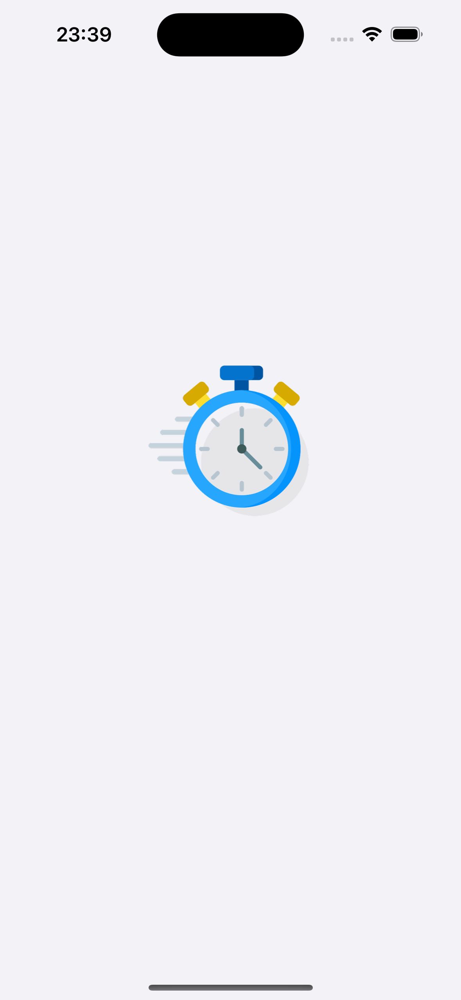
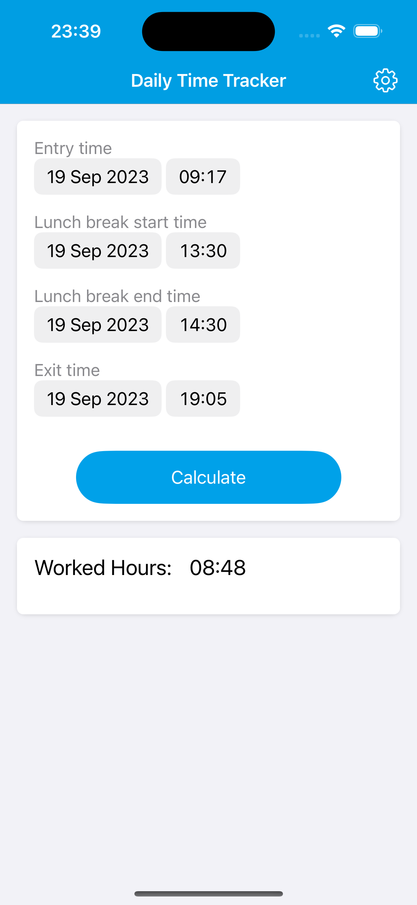
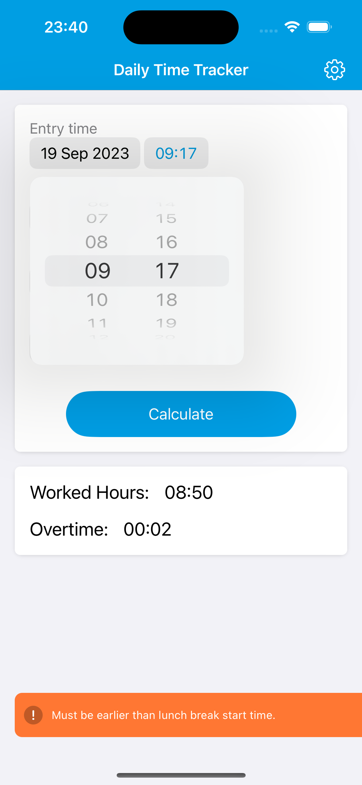
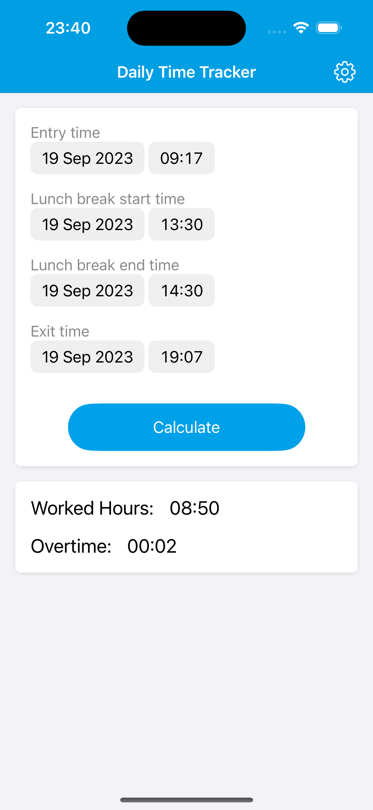
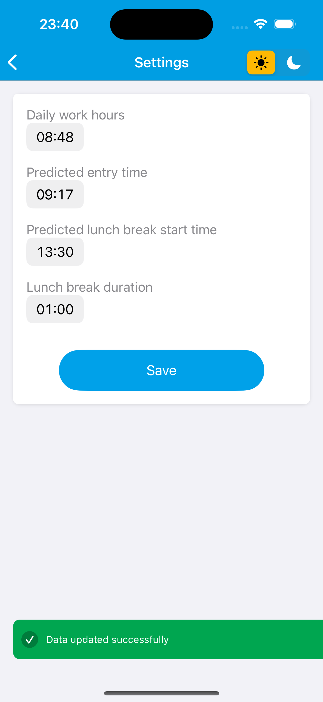
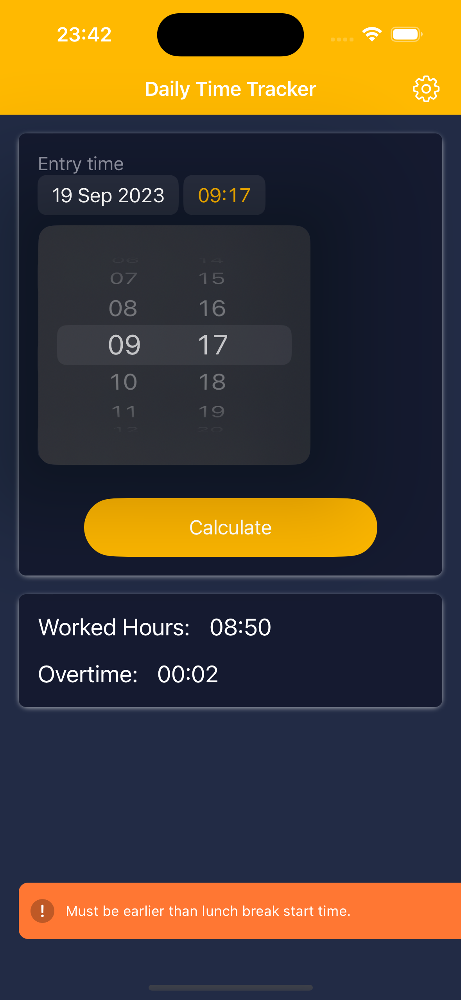
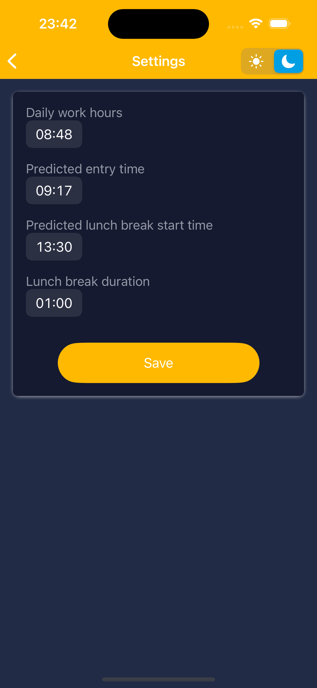

  [:us:](README.md "View the README in English")

# Aplicativo Ponto Diário

## Bem-Vindo ao Repositório do Aplicativo Ponto Diário!

O Aplicativo Ponto Diário é uma ferramenta simples e prática para auxiliar os usuários a gerenciar sua jornada diária de trabalho. Este aplicativo foi projetado para calcular uma previsão do horário de saída com base nas horas de trabalho configuradas pelo usuário e exibir o tempo total trabalhado no dia atual.

## Imagens do Aplicativo

| Vídeo do App | Tela de Carregamento | Tela Inicial (light) |
| :---: | :---: | :---: |
|  |  |  |

| Mensagem de Alerta (light) | Cálculo de Horas Trabalhadas (light) | Tela de Configurações (light) |
| :---: | :---: | :---: |
|  |  |  |

| Mensagem de Alerta (dark) | Cálculo de Horas Trabalhadas (dark) | Tela de Configurações (dark) |
| :---: | :---: | :---: |
|  |  |  |

## Recursos

- *Previsão de Saída*: Com base nas horas de trabalho definidas, o aplicativo calcula uma estimativa do horário de saída do usuário.
- *Acompanhamento de Tempo*: Monitore o total de horas trabalhadas no dia atual.
- *Configuração Personalizada*: Defina suas horas de trabalho diárias nas configurações do aplicativo.
- *Escolha de Idioma*: Com base nas configurações de idioma do seu dispositivo móvel, o aplicativo automaticamente seleciona o idioma (atualmente apenas Inglês e Português).
- *Tema Personalizado*: Escolha se deseja que o aplicativo use cores claras (light mode) ou escuras (dark mode).

## Tecnologias Utilizadas

O Aplicativo foi desenvolvido utilizando a linguagem Swift, usando um código 100% nativo. Isso significa que você não precisa instalar nenhuma dependência para executar o App.

## Como Usar

1. Instale o aplicativo em seu dispositivo móvel.
2. Configure suas horas de trabalho diárias nas configurações do aplicativo.
3. O aplicativo calculará automaticamente o horário estimado de saída e o tempo trabalhado no dia atual.

## Principais Aprendizados e Desafios

### Programaticamente

- Implementação de `Localização` no App para alternar entre inglês e português com base nas configurações de idioma do dispositivo móvel.
- Implementação de um Tema (light/dark mode) configurável pelo usuário.
- Utilização de `UserDefaults` para persistir os dados do tema (light/dark mode) escolhido e das configurações ajustadas.
- Uso de `observers` para gerenciar a troca do tema.
- Criação de um componente `Toast` para enviar notificações ao usuário, incluindo opções de configurações: `success`, `failed`, `alert` e `neutral`.
- Implementação de animações de transição no componente `Toast`.

### No Storyboard

- Utilização de um conjunto de cores adaptáveis ao tema escolhido (light/dark mode).
- Uso de `stack view` para simplificar o gerenciamento de `constraints`.
- Utilização de `User Defined Runtime Attributes` para a gestão da `localização` (troca de idioma) pelo storyboard.
- Uso de `@IBInspectable` para facilitar a alteração do idioma em elementos do `storyboard`.

## Contribuições

Contribuições para o aplicativo Ponto Diário são bem-vindas! Sinta-se à vontade para abrir issues, enviar pull requests ou sugerir novas funcionalidades.

## Licença

Este projeto está licenciado sob a [Licença MIT](LICENSE).

Baixe agora o aplicativo Ponto Diário e mantenha o controle do seu tempo de trabalho diário!